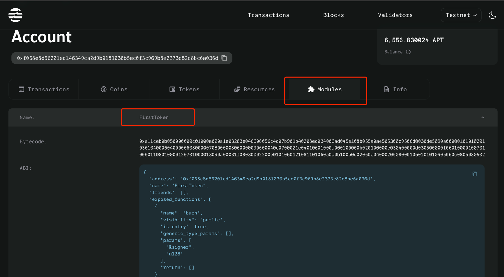
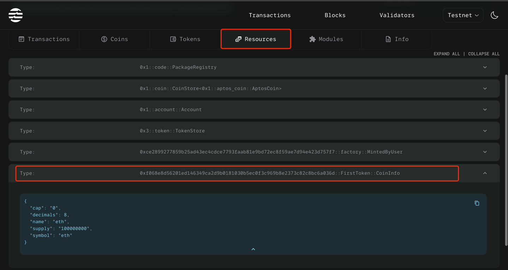
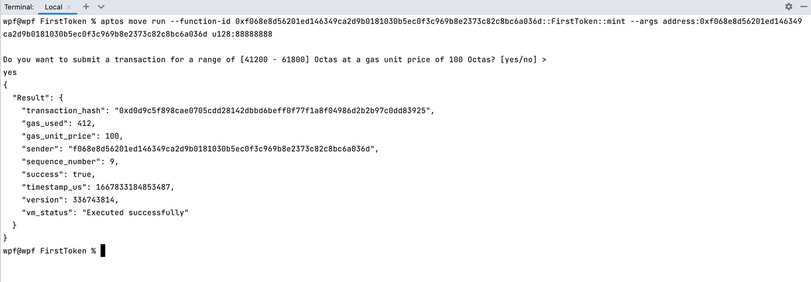
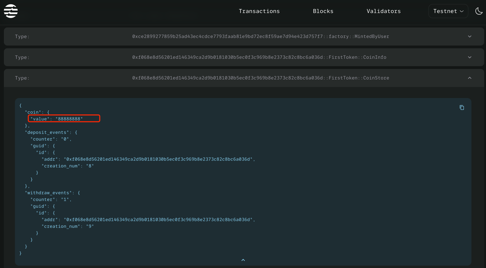

# ```move```进阶:```move```实现```ERC20```标准代币

## 1.创建一个工程

+ 第一种：使用IDEA创建一个move工程，项目名```FirstToken```
+ 第二种：手动创建项目
    + 创建项目文件夹 ```mkdir FirstToken  ```
    + 切换到当前的工程目录 ```cd FirstToken```
    + 创建合约目录目录 ```mkdir sources```
    + 创建项目配置文件 ```touch Move.toml```
    + idea导入```FirstToken```工程

## 2. 在工程目录底下执行```aptos init```

> 执行完之后，工程里面会多出一个```.aptos```的目录。里面有一个```config.yaml```,里面配置的如下：

```yaml
---
profiles:
  default:
    private_key: "****"
    public_key: "****"
    account: dc33b8ca18676247c66e607bc638b54b6cbc789d68cb20e5158ce8fe6131434b
    rest_url: "https://fullnode.testnet.aptoslabs.com"
```

> ```config.yaml```包含了刚刚配置的私钥、公钥、账户和对应网络的```RPC```节点。然后编辑```Move.toml```（注:通过IDEA创建的项目，Move.toml已经引入了相关依赖）

```toml
[package]
name = 'FirstToken'
version = '1.0.0'
[dependencies.AptosFramework]
git = 'https://github.com/aptos-labs/aptos-core.git'
rev = 'main'
subdir = 'aptos-move/framework/aptos-framework'

[addresses]
sender = '<config.yaml profiles.default.account>'
```

> 最终的项目结构如下图:


## 3.在sources目录下创建一个```FirstToken.move```的```module```，开始编写Erc20合约

```move
module sender::FirstToken {
  use std::signer;
  use std::string;
  use aptos_framework::account;
  use aptos_framework::event;

  struct DepositEvent has drop, store {
    amount: u128,
  }

  struct WithdrawEvent has drop, store {
    amount: u128,
  }

  struct Coin has store {
    value: u128
  }

  struct CoinStore has key {
    coin: Coin,
    deposit_events: event::EventHandle<DepositEvent>,
    withdraw_events: event::EventHandle<WithdrawEvent>,
  }

  struct CoinInfo has key {
    name: string::String,
    symbol: string::String,
    decimals: u8,
    supply: u128,
    cap: u128,
  }


  const OWNER: address = @sender;

  const REGISTERED: u64 = 1;

  const INVALID_OWNER: u64 = 2;

  const THE_ACCOUNT_IS_NOT_REGISTERED: u64 = 3;

  const INSUFFICIENT_BALANCE: u64 = 4;

  const ECOIN_INFO_ALREADY_INIT: u64 = 5;

  const EXCEEDING_THE_TOTAL_SUPPLY: u64 = 6;

  public entry fun initialize(
    address: &signer,
    name: string::String,
    symbol: string::String,
    decimals: u8,
    supply: u128
  ) {
    assert!(signer::address_of(address) == OWNER, INVALID_OWNER);
    assert!(!exists<CoinInfo>(OWNER), ECOIN_INFO_ALREADY_INIT);
    move_to(address, CoinInfo {  name, symbol, decimals, supply, cap: 0 });
  }

  fun deposit(account_addr: address, coin: Coin) acquires CoinStore {
    assert!(exists_coin(account_addr), THE_ACCOUNT_IS_NOT_REGISTERED);
    let balance = getBalance(account_addr);
    let coin_store = borrow_global_mut<CoinStore>(account_addr);
    let balance_ref = &mut coin_store.coin.value;
    *balance_ref = balance + coin.value;
    event::emit_event(&mut coin_store.deposit_events,DepositEvent { amount: coin.value });
    let Coin { value: _ } = coin;
  }


  fun withdraw(account_addr: address, amount: u128): Coin acquires CoinStore {
    assert!(exists_coin(account_addr), THE_ACCOUNT_IS_NOT_REGISTERED);
    let balance = getBalance(account_addr);
    assert!(balance >= amount, INSUFFICIENT_BALANCE);
    let coin_store = borrow_global_mut<CoinStore>(account_addr);
    let balance_ref = &mut coin_store.coin.value;
    *balance_ref = balance - amount;
    event::emit_event(&mut coin_store.withdraw_events,WithdrawEvent {amount});
    Coin { value: amount }
  }

  public entry fun transfer(from: &signer, to: address, amount: u128) acquires CoinStore {
    let coin = withdraw(signer::address_of(from), amount);
    deposit(to, coin);
  }


  public entry fun burn(owner: &signer, amount: u128) acquires CoinStore, CoinInfo {
    assert!(signer::address_of(owner) == OWNER, INVALID_OWNER);
    let coin = withdraw(signer::address_of(owner), amount);
    let Coin { value: amount } = coin;
    let cap = &mut borrow_global_mut<CoinInfo>(OWNER).cap;
    *cap = *cap - amount;
    let supply = &mut borrow_global_mut<CoinInfo>(OWNER).supply;
    *supply = *supply - amount;
  }

  public entry fun mint(owner: &signer, to: address, amount: u128) acquires CoinStore, CoinInfo {
    assert!(signer::address_of(owner) == OWNER, INVALID_OWNER);
    assert!(
      borrow_global<CoinInfo>(OWNER).cap + amount <= borrow_global<CoinInfo>(OWNER).supply,
      EXCEEDING_THE_TOTAL_SUPPLY
    );
    deposit(to, Coin { value: amount });
    let cap = &mut borrow_global_mut<CoinInfo>(OWNER).cap;
    *cap = *cap + amount;
  }


  public fun getBalance(owner: address): u128 acquires CoinStore {
    assert!(exists_coin(owner), THE_ACCOUNT_IS_NOT_REGISTERED);
    borrow_global<CoinStore>(owner).coin.value
  }

  public entry fun register(address: &signer) {
    let account = signer::address_of(address);
    assert!(!exists<CoinStore>(account), REGISTERED);
    move_to(address, CoinStore {
      coin: Coin { value: 0 },
      deposit_events: account::new_event_handle<DepositEvent>(address),
      withdraw_events: account::new_event_handle<WithdrawEvent>(address)
    });
  }

  public fun exists_coin(account_addr: address): bool {
    exists<CoinStore>(account_addr)
  }
}
```

## 4.编译并发布合约到测试网

### 4.1 编译测试合约代码

```shell
 aptos move test
```

### 4.2 发布合约到测试网

```shell
 aptos move publish
```

> 输出结果如下，说明部署成功,


### 4.3 去[区块链浏览器](https://explorer.aptoslabs.com/account/0xf068e8d56201ed146349ca2d9b0181030b5ec0f3c969b8e2373c82c8bc6a036d/resources)查看

> 在```modules```下多了```FirstToken```这个```modlue```



### 4.4 与合约交互

### 4.4.1 初始化代币信息，调用```FirstToken::initialize```方法
```shell
aptos move run --function-id 0xf068e8d56201ed146349ca2d9b0181030b5ec0f3c969b8e2373c82c8bc6a036d::FirstToken::initialize --args string:eth string:eth u8:8 u128:100000000
```


> 在```resource```下多了```FirstToken::CoinInfo```这个```resorces```




### 4.4.2 地址```mint```代币前，初始化对应```Coin```资源,调用```FirstToken::register```方法

> **这里要调用这个方式是因为```move```是面向资源编程的，只要账户下有了这个资源，才能进行资源转移的相关操作。**
> 
> **这里还要注意，如果你想为哪个地址初始化资源，得重新执行```aptos init```,换成对应地址下的私钥**,
> 在这里我们没有重新执行```aptos init```是因为合约部署和合约方法调用是用的同一个账号。
```shell
aptos move run --function-id 0xf068e8d56201ed146349ca2d9b0181030b5ec0f3c969b8e2373c82c8bc6a036d::FirstToken::register
```


>在区块链浏览器上可以看到，在```resource```下多了```FirstToken::CoinStore```这个```resorces```,且```coin.value=0```


### 4.4.3 为地址```mint```代币，调用```FirstToken::mint```方法
```shell
aptos move run --function-id 0xf068e8d56201ed146349ca2d9b0181030b5ec0f3c969b8e2373c82c8bc6a036d::FirstToken::mint --args address:0xf068e8d56201ed146349ca2d9b0181030b5ec0f3c969b8e2373c82c8bc6a036d u128:88888888
```



>在区块链浏览器上可以看到，在```resource```下多了```FirstToken::CoinStore```这个```resorces```,此时```coin.value=88888888```



### 4.4.4 获取余额
```
https://fullnode.testnet.aptoslabs.com/v1/accounts/0xf068e8d56201ed146349ca2d9b0181030b5ec0f3c969b8e2373c82c8bc6a036d/resource/0xf068e8d56201ed146349ca2d9b0181030b5ec0f3c969b8e2373c82c8bc6a036d::FirstToken::CoinStore
```

```json
{
  type: "0xf068e8d56201ed146349ca2d9b0181030b5ec0f3c969b8e2373c82c8bc6a036d::FirstToken::CoinStore",
  data: {
    coin: {
      value: "88888888"
    },
    deposit_events: {
      counter: "0",
      guid: {
        id: {
          addr: "0xf068e8d56201ed146349ca2d9b0181030b5ec0f3c969b8e2373c82c8bc6a036d",
          creation_num: "8"
        }
      }
    },
    withdraw_events: {
      counter: "1",
      guid: {
        id: {
          addr: "0xf068e8d56201ed146349ca2d9b0181030b5ec0f3c969b8e2373c82c8bc6a036d",
          creation_num: "9"
        }
      }
    }
  }
}
```

----
> 至此我们完成了一个标准的ERC20合约的开发和部署，下一讲我们对ERC20合约的代码进行解读，源码分析完后，我们将使用```aptos```提供的```aptos-sdk```去和合约交互。


